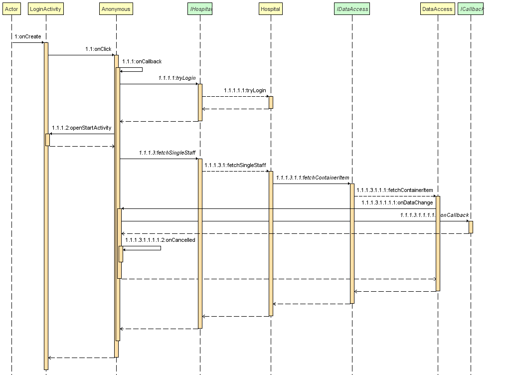

# SepsisMonitor
**Ever wanted to buy a hospital?**  
Here is your sepsis department management app!  

## User Guide
1. Start the app
2. Login with your credentials
3. Click on patients to change their phase (or assign them to a staff)  

## Developer Guide
The app is build by 3 layers.  
1. TOP / GUI Layer
2. MIDDLE / Logic Layer
3. BOTTOM / Data(base-access) Layer  
Communication between layers is only done by interfaces.
This allows us to change every layer.
If you would like a WebApp instead, only change the GUI Layer and you are done.
You don't like realtime databases? No problem,
simply reimplement the Data(base-access) Layer Interfaces for your database of choice, 
and use the app as you know it.  

### Sample Data Flow
